Based on the supplied context, the module capabilities and execution steps are described as follows:

The `run_pipeline` function iterates over records, applies a transform, and returns the list [pipeline.py:17-19]. At call-site **pipeline.py:19**, `run_pipeline` calls **transform** [pipeline.py:19-19]. Inside **transform**, at call-site **pipeline.py:8**, it accesses `record['title'].strip()` [pipeline.py:8-8] and calls `str(record["id"])` [pipeline.py:8-8], both identified as external/unresolved leaves. At call-site **pipeline.py:9**, `transform` calls **write_to_db** [pipeline.py:9-9]. Inside **write_to_db**, at call-site **pipeline.py:14**, it delegates to `repo.save(record)` [pipeline.py:14-14]. Inside **Repository.save**, at call-site **db/repository.py:14**, it checks `task.get("id")` [db/repository.py:14-14], another external/unresolved leaf. If the condition fails, at call-site **db/repository.py:15**, it raises a `ValueError` [db/repository.py:15-15]. Finally, at call-site **db/repository.py:16**, it calls `self.connection.execute(task["id"], task)` [db/repository.py:16-16].

```mermaid
flowchart TD
  n0["run_pipeline"]
  n1["transform"]
  n0 -->|comp| n1
  n2["record&#91;'title'&#93;.strip"]
  n1 --> n2
  n3["str"]
  n1 --> n3
  n4["write_to_db"]
  n1 --> n4
  n5["Repository.save"]
  n4 --> n5
  n6["task.get"]
  n5 -->|if| n6
  n7["ValueError"]
  n5 -->|if| n7
  n8["Connection.execute (...2 more)"]
  n5 --> n8
```

| Call site | Symbol | Condition | Source / confidence |
| --- | --- | --- | --- |
| pipeline.py:17 | run_pipeline |  | root /  |
| pipeline.py:19 | transform | comp | ast / 0.9 |
| pipeline.py:8 | record['title'].strip |  | ast / 0.0 |
| pipeline.py:8 | str |  | ast / 0.0 |
| pipeline.py:9 | write_to_db |  | ast / 0.9 |
| pipeline.py:14 | Repository.save |  | ast / 0.8 |
| db/repository.py:14 | task.get | if | ast / 0.0 |
| db/repository.py:15 | ValueError | if | ast / 0.0 |
| db/repository.py:16 | Connection.execute |  | ast / 0.8 |
